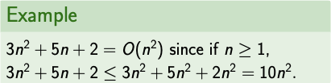
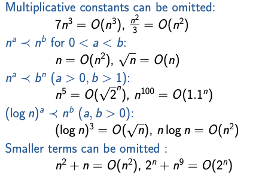
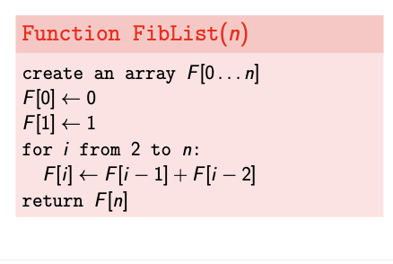
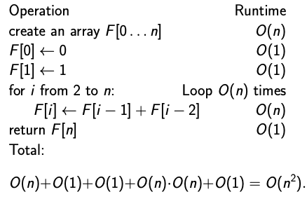

# Computing Runtimes Hard  
- Depends on fine details of program. 
- Depends on details of computer.
# IDEA
- All of these issues can multiply runtimes by (large) constant. So measure runtime in a way that ignores constant multiples.
- Consider asymptotic runtimes. How does runtime scale with input size.
# What is Big-O Notation?
**Big-O notation** is used to describe the performance or complexity of an algorithm. Specifically, it describes the *worst-case scenario* in terms of *time* or *space complexity*.
```
f(n) = O(g(n)) (f isBig-O ofg) or f ⪯ g if there exist constants N and c so that for all n ≥ N, f (n) ≤ c · g(n).
```
f is bounded above by some constant multiple of g.

### Example:


**Important Point:**
- Big O notation only describes the asymptotic behavior of a function, not its exact value.
- The Big O notation can be used to compare the efficiency of different algorithms or data structures.

# Common Rules
## 1. Multiplicative constants can be omitted:


## Example




