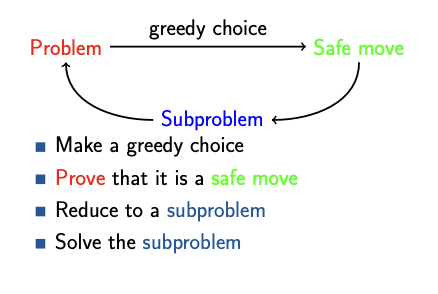
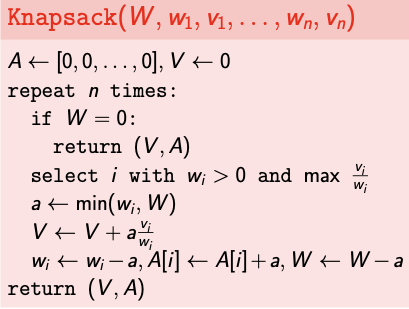

# Greedy Algorithms
A greedy algorithm is a type of optimization algorithm that makes locally optimal choices at each step to find a globally optimal solution. It operates on the principle of “taking the best option now” without considering the long-term consequences.

# Greedy Strategy
- Make some greedy choice 
- Reduce to a smaller problem 
- Iterate

For example: What is the largest number that consists of digits 3, 9, 5, 9, 7, 1? Use all the digits.
Strategy:
- Find max digit  
- Append it to the number  
- Remove it from the list of digits Repeat while there are digits in the list

**Subproblem** is a similar problem of smaller size.
A greedy choice is called **safe move** if there is an optimal solution consistent with this first move.

# Steps for Creating a Greedy Algorithm
The steps to define a greedy algorithm are:
1. Define the problem: Clearly state the problem to be solved and the objective to be optimized.
2. Identify the greedy choice: Determine the locally optimal choice at each step based on the current state.
3. Make the greedy choice: Select the greedy choice and update the current state.
4. Repeat: Continue making greedy choices until a solution is reached.

# Applications of Greedy Algorithm
There are many applications of the greedy method in DAA. Some important greedy algorithm applications are:
- Assigning tasks to resources to minimize waiting time or maximize efficiency.
- Selecting the most valuable items to fit into a knapsack with limited capacity.
- Dividing an image into regions with similar characteristics.
- Reducing the size of data by removing redundant information.

# Disadvantages/Limitations of Using a Greedy Algorithm
Below are some disadvantages of the Greedy Algorithm:
- Greedy algorithms may not always find the best possible solution.
- The order in which the elements are considered can significantly impact the outcome.
- Greedy algorithms focus on local optimizations and may miss better solutions that require considering a broader context.
- Greedy algorithms are not applicable to problems where the greedy choice does not lead to an optimal solution.

# Example

Fractional knapsack

Input: Weights w1, . . . , wn and values v1,...,vn of n items; capacity W.
Output: The maximum total value of fractions of items that fit into a
bag of capacity W .

There exists an optimal solution that uses as much as possible of an item with the maximal value per unit of weight.

Algorithm:
- While knapsack is not full
- Choose item i with maximum vi / wi
- If item fits into knapsack, take all of it
- Otherwise take so much as to fill the knapsack
- Return total value and amounts taken
  

The running time of Knapsack is O(n2).

