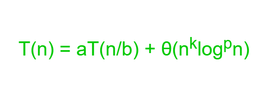

# Divide and Conquer Algorithm

Divide and Conquer Algorithm involves breaking a larger problem into smaller subproblems, solving them independently, and then combining their solutions to solve the original problem. The basic idea is to recursively divide the problem into smaller subproblems until they become simple enough to be solved directly. Once the solutions to the subproblems are obtained, they are then combined to produce the overall solution.

1. Divide:
- Break down the original problem into smaller, non-overlapping subproblems of the same type subproblems.
- Each subproblem should represent a part of the overall problem.
- The goal is to divide the problem until no further division is possible.
2. Conquer: 
- Solve each of the smaller subproblems individually.
- If a subproblem is small enough (often referred to as the “base case”), we solve it directly without further recursion.
- The goal is to find solutions for these subproblems independently.
3. Merge:
- Combine the sub-problems to get the final solution of the whole problem.
- Once the smaller subproblems are solved, we recursively combine their solutions to get the solution of larger problem.
- The goal is to formulate a solution for the original problem by merging the results from the subproblems.


For example: Find max
Divide and Conquer Algorithm to find the maximum element in the array by dividing the array into two equal sized subarrays, finding the maximum of those two individual halves by again dividing them into two smaller halves. This is done till we reach subarrays of size 1. After reaching the elements, we return the maximum element and combine the subarrays by returning the maximum in each subarray.

```C++
// function to find the maximum no.
// in a given array.
int findMax(int a[], int lo, int hi)
{
    // If lo becomes greater than hi, then return minimum
    // integer possible
    if (lo > hi)
        return INT_MIN;
    // If the subarray has only one element, return the
    // element
    if (lo == hi)
        return a[lo];
    int mid = (lo + hi) / 2;
    // Get the maximum element from the left half
    int leftMax = findMax(a, lo, mid);
    // Get the maximum element from the right half
    int rightMax = findMax(a, mid + 1, hi);
    // Return the maximum element from the left and right
    // half
    return max(leftMax, rightMax);
}
```

# Master Theorem
Master Theorem is used to determine running time of algorithms (divide and conquer algorithms) in terms of asymptotic notations. 

Consider a problem that is solved using recursion. 
```C++
function f(input x size n)
if(n < k)
solve x directly and return 
else
divide x into a subproblems of size n/b
call f recursively to solve each subproblem
Combine the results of all sub-problems
```

The above algorithm divides the problem into a subproblems, each of size n/b and solve them recursively to compute the problem and the extra work done for problem is given by f(n), i.e., the time to create the subproblems and combine their results in the above procedure. 

So, according to master theorem the runtime of the above algorithm can be expressed as:  T(n) = aT(n/b) + f(n)   

where n = size of the problem 
a = number of subproblems in the recursion and a >= 1 
n/b = size of each subproblem 
f(n) = cost of work done outside the recursive calls like dividing into subproblems and cost of combining them to get the solution. 

Not all recurrence relations can be solved with the use of the master theorem i.e. if 
 

T(n) is not monotone, ex: T(n) = sin n
f(n) is not a polynomial, ex: T(n) = 2T(n/2) + 2n
This theorem is an advance version of master theorem that can be used to determine running time of divide and conquer algorithms if the recurrence is of the following form :


where n = size of the problem 

a = number of subproblems in the recursion and a >= 1 

n/b = size of each subproblem 

b > 1, k >= 0 and p is a real number. Then, 

if a > bk, then T(n) = θ(nlogba),

if a = bk, then 
- (a) if p > -1, then T(n) = θ(nlogba logp+1n) 
- (b) if p = -1, then T(n) = θ(nlogba loglogn) 
- (c) if p < -1, then T(n) = θ(nlogba) 
 
if a < bk, then
- (a) if p >= 0, then T(n) = θ(nk logpn) 
- (b) if p < 0, then T(n) = θ(nk) 

